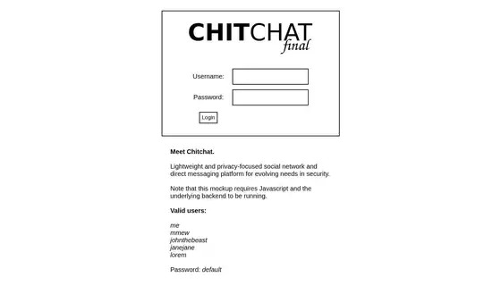

# Creative Project 5

A simple Twitter clone developed as a free-form project for CS 260.

**Project goals:**
- Explore practical uses of Axios, as covered in the course material
- Gain hands-on experience with MongoDB and NoSQL databases

**Not included:**
- Complete separation of concerns
- Secure credential management and storage

Developed in December 2022.